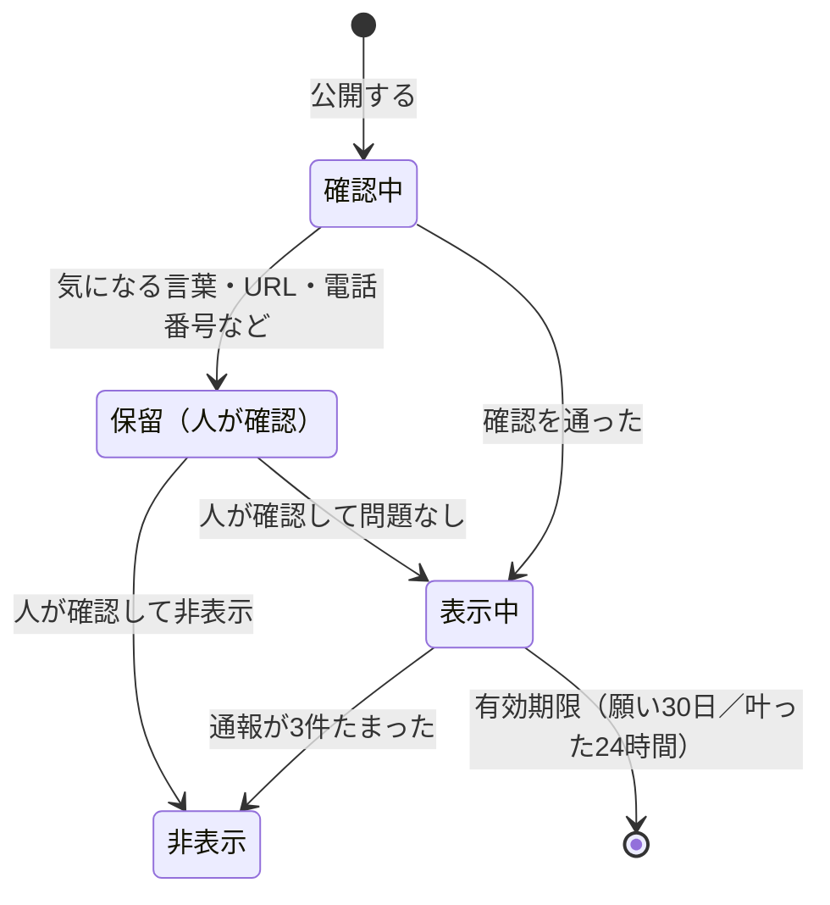

# みんなの星（匿名の共有）設計

作成：2026-09-30　きっかけ：メンター会（増渕メンター）　関連 Issue：#22〜#25

## メンター会で受けたヒント

| ヒント | 設計への反映 |
| --- | --- |
| 作品の顔（第一印象）とストーリーは強い。コンペでは物語が効く。**選考用のストーリーは今日から練る** | #24 発表の物語。言葉は何度も足したり引いたりするので、実装と並行して進める |
| **技術の評価としては、マルチユーザーのほうが嬉しい**。ログインは不要・匿名でよい。自分のものと他人のものの識別、出す分量など「データ管理」を少し足す | 本書の「みんなの星」。匿名の共有、表示の選び方、上限、有効期限、自分と他人の区別 |
| 星空の中で、ときどき**他の人の短いメッセージ**が見られる | 軌道に、他の人が公開した願いの星を少しだけ混ぜる |
| **願いが叶った人のコメント**が、1日だけ残る。演出を変える（流れ星など） | 「叶ったよ」のひとことを24時間だけ流れ星として見せる |
| 25143 を**親番**にして、**枝番**（25143-0312 など）で広げる。みんなのウィッシュが集まると強い | 公開した端末に枝番を発行。キーホルダーにも刻める |
| いいね・応援の仕組み | 既存の「応援の信号」を、他の人の星にも送れるようにする |
| マネタイズは**物理を絡めると**説明しやすい（番号つきの物は値がつけやすい） | 枝番入りの NFC キーホルダー（MORUNE）を事業の説明に使う（#24） |
| 番号や画像の**権利は軽く調べる** | #25 権利の確認 |
| AI は、まず自分で要件を分解し、指示とレビューを自分で一度やる | 本書を先に書き、AI に渡す前に人が確かめる |
| 判定に特化した小さな AI（分類・点数・はい／いいえ）は安く速い | 公開する言葉の安全確認の「次の段階」として検討（#23） |

## 何を作るか

### 1. 公開は選べる（初期値は「公開しない」）

入院中の人の願いは個人的な内容になりやすい。**公開しないのが初期値**で、公開したい願いだけを選ぶ。

- 預けるときに「この願いを、名前を出さずに星空に流す」を選べる
- 公開するのは言葉だけ（60字まで）。名前・端末の情報は出さない
- 公開した願いも、自分の端末の記録は今までどおり端末の中にある

### 2. 星空に、他の人の星が少しだけ混ざる

- 自分の星は金色、他の人の星は青白く小さく描き、ひと目で区別できる
- 他の人の星に触れると、言葉が読める。「応援の信号を送る」ができる
- 表示の量：1回に**12個まで**。有効な公開の中から、自分のものを除いてランダムに選ぶ（毎回少し入れ替わる）
- 公開の有効期限：**30日**。過ぎた星は選ばれない

### 3. 叶ったよ、のひとこと（24時間の流れ星）

- 「想いを受け取る」を選んだあと、任意で「叶ったよ」のひとこと（40字まで）を流せる
- **24時間だけ**、他の人の星空に流れ星として出る。そのあとは選ばれない

### 4. 枝番（25143-XXXX）

- 初めて公開した端末に、サーバーが順番に番号を発行する（25143-0001 から）
- 自分の星空に「あなたの番号」として出る。枝番入りのキーホルダーの話につなげる
- 枝番は、名前や端末と結びつく情報を持たない

## データ

D1（Cloudflare）に、次の表を足す。すでにある `signals` はそのまま使う。

| 表 | 列 | 説明 |
| --- | --- | --- |
| `orbits` | `id`（軌道ID、端末で作るUUID）、`number`（枝番、連番）、`created_at` | 公開した端末だけ。名前や IP は持たない |
| `public_stars` | `id`、`orbit_id`、`kind`（`wish` / `fulfilled`）、`text`、`status`（`visible` / `held` / `hidden`）、`reports`、`created_at`、`expires_at` | 公開された言葉 |

### 公開された言葉の状態

### 上限（`docs/状態設計.md` の #17 に足す）

| もの | 上限 |
| --- | --- |
| 1つの軌道が公開できる願い | 1日3つまで（連投を防ぐ） |
| 叶ったよ、のひとこと | 40字、1日3つまで |
| 1回に見える他の人の星 | 12個 |
| 通報 | 1台の端末から、同じ星へは1回 |

## 安全（#23）

匿名の言葉を他の人に見せるので、最初から次を入れる。

- **確認**：URL、メールアドレス、電話番号らしい並び、登録した注意語が入っていたら「保留」にして表示しない（ルールで判定、テストで確かめる）
- **通報**：他の人の星に「通報」。3件で非表示
- **次の段階**：判定に特化した小さな AI で「表示してよいか」を はい／いいえ で判定する（メンター会のヒント）。AI の答えは揺れるので、保留にするかどうかの判断にだけ使い、消す判断は人が持つ（講義資料：取り返しのつかない操作の手前に人を置く）

## 病室（ネットなし）では

- 他の人の星は、最後にネットにつながったときに受け取った分を端末に控えて見せる
- 公開と通報はネットが必要。ネットがないときは「Wi-Fi につながったら流せます」と案内し、自分の願いを預けることは今までどおりできる

## 作る順番と見積もり

| 順 | 内容 | 目安 |
| --- | --- | --- |
| 1 | D1 の作成（本人の了承が必要）、表の追加 | 0.25日 |
| 2 | 公開・取得・通報の API と、確認のルール（テスト） | 0.75日 |
| 3 | 預ける画面の「公開する」、星空の他の人の星、触れたときのカード | 0.75日 |
| 4 | 叶ったよ（流れ星）、枝番の表示 | 0.5日 |
| 5 | スマホでの確認、5人の検証に「みんなの星」を含める（#20） | 0.25日 |

## 決めてほしいこと

- Cloudflare に D1 を作ってよいか（無料枠で足りる見込み。#10 の応援の信号も同時に使えるようになる）
- GGA のセレクション（選考）と本選の日付
