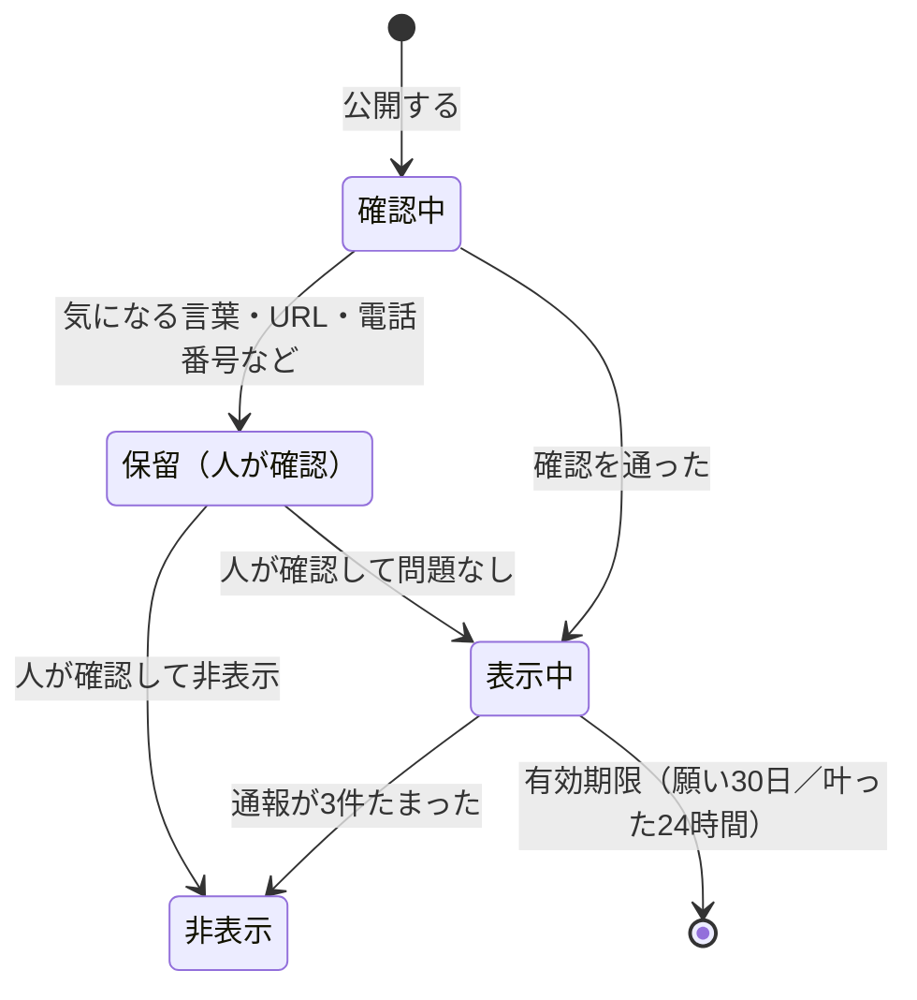

# みんなの星（匿名の共有）設計

作成：2026-09-30　きっかけ：メンター会（増渕メンター）　関連 Issue：#22〜#25

## 進み具合（2026-09-30 時点）

| 項目 | 状態 |
| --- | --- |
| 1. 公開は選べる・約束 | 実装済み（ブランチ `feat/minna-no-hoshi`）。未公開 |
| 2. 他の人の星・カード（信号と通報だけ） | 実装済み。未公開 |
| 3. 叶ったよ（24時間の流れ星） | 実装済み。未公開 |
| 4. 枝番 | 実装済み。回収記録と帰還証明書に出す。未公開 |
| 安全（#23）：ルールの確認・通報3件で非表示 | 実装済み。「人の確認」は管理画面ではなく、README の SQL で行う（管理画面は次の段階） |
| D1 の表（`drizzle/0002_public_stars.sql`） | 未作成。本番への作成は本人の了承のあと |
| 小さな AI での判定 | 次の段階（未着手） |

実装の場所：API `app/api/stars/`（数とルールは `rules.mjs`）、画面 `public/mission.js`・`public/public-stars.js`、表 `db/schema.ts`。

実装で決めたこと：

- 他の人の星の軌道ID は画面に渡さない。応援の信号は `/api/stars/signal` が星から持ち主を引いて送る（軌道ID が分かると、届いた信号の時刻まで読めてしまうため）
- 保留になった理由の種類は本人に返さない（どう書けば通るかの手がかりにしないため）。本人には「確かめてから星空に出します」とだけ伝える
- 注意語には、つらい気持ちの言葉（死にたい など）も入れて保留にする。晒すより先に人が見る
- 「近くの病院」のような言葉まで保留にしないよう、病院名らしい並びは漢字・カタカナ・英数字の2文字以上＋病院／医院／クリニック／医療センターだけにした。「大学病院」は保留になるが、人が見て表示に戻せる
- 通報に使う軌道ID は端末で作るので、作り直せば同じ人が何度も通報できる。3件で「非表示」にはなるが、消すのではなく人が確かめるので、取り返しはつく

## メンター会で受けたヒント

| ヒント | 設計への反映 |
| --- | --- |
| 作品の顔（第一印象）とストーリーは強い。コンペでは物語が効く。**選考用のストーリーは今日から練る** | #24 発表の物語。言葉は何度も足したり引いたりするので、実装と並行して進める |
| **技術の評価としては、マルチユーザーのほうが嬉しい**。ログインは不要・匿名でよい。自分のものと他人のものの識別、出す分量など「データ管理」を少し足す | 本書の「みんなの星」。匿名の共有、表示の選び方、上限、有効期限、自分と他人の区別 |
| 星空の中で、ときどき**他の人の短いメッセージ**が見られる | 軌道に、他の人が公開した願いの星を少しだけ混ぜる |
| **願いが叶った人のコメント**が、1日だけ残る。演出を変える（流れ星など） | 「叶ったよ」のひとことを24時間だけ流れ星として見せる |
| 25143 を**親番**にして、**枝番**（25143-0312 など）で広げる。みんなのウィッシュが集まると強い | 公開した端末に枝番を発行。キーホルダーにも刻める |
| いいね・応援の仕組み | 既存の「応援の信号」を、他の人の星にも送れるようにする |
| マネタイズは**物理を絡めると**説明しやすい（番号つきの物は値がつけやすい） | 枝番入りの NFC キーホルダー（MORUNE）を事業の説明に使う（#24） |
| 番号や画像の**権利は軽く調べる** | #25 権利の確認 |
| AI は、まず自分で要件を分解し、指示とレビューを自分で一度やる | 本書を先に書き、AI に渡す前に人が確かめる |
| 判定に特化した小さな AI（分類・点数・はい／いいえ）は安く速い | 公開する言葉の安全確認の「次の段階」として検討（#23） |

## 似たサービスから取り入れること（2026-09-30 調査）

くわしくは `docs/類似サービス調査.md`。

| 学んだこと | 元になった例 | この設計でどうするか |
| --- | --- | --- |
| 匿名で、誰にでも自由に返信できる場は荒れて終わる | Yik Yak、Secret（どちらも終了） | 他の人の星には**返信を作らない**。反応は「応援の信号」だけ。フォロー・いいねの数も出さない |
| 最初の約束と人の目が、匿名の場をやさしく保つ | Kind Words | はじめて公開する前に「やさしい言葉だけを流します」に同意してもらう。保留になった言葉は人が見る |
| 伝え合う手段を絞ると、かえって心がつながる | Journey | 応援の信号は「光る」だけ。誰から来たかは出さない |
| 遅さ・距離そのものが価値になる | Slowly、FutureMe | 帰還カードに「光の速さでも約◯分かかる距離」を出す（#26） |
| 持ち帰れる記念品が、人に見せたくなる気持ちを生む | NASA 搭乗券、JAXA 探査18きっぷ | 帰ってきた願いに「帰還証明書」（画像で保存・共有できる）を出す（#26） |
| 「星に名前が付く」と売ると信頼をなくす | 星の命名の販売（IAU は認めていない） | 枝番は「この作品の中の番号」と画面と規約に明記する。IAU・JAXA とは関係ないと書く |
| 使い始めの1週間で価値が見えないと離れる | 目標・やりたいことアプリ（100日で約7割が離脱） | はじめての人は、預けた直後に1つ帰ってくる体験までを1分で通す（#27） |
| 1つの外部サービスに頼ると、止まったとき全部止まる | ひとりぼっち惑星（クラウド終了で一時停止） | 自分の願いは端末に保存したまま。公開した言葉は D1 から書き出せる手順を用意する |

## 何を作るか

### 1. 公開は選べる（初期値は「公開しない」）

入院中の人の願いは個人的な内容になりやすい。**公開しないのが初期値**で、公開したい願いだけを選ぶ。

- はじめて公開するときだけ、約束の画面を出す：「やさしい言葉だけを流します／名前・連絡先・病院名は書きません／他の人の願いを笑いません」。同意しないと公開できない
- 預けるときに「この願いを、名前を出さずに星空に流す」を選べる
- 公開するのは言葉だけ（60字まで）。名前・端末の情報は出さない
- 公開した願いも、自分の端末の記録はこれまでと同じように端末の中にある

### 2. 星空に、他の人の星が少しだけ混ざる

- 自分の星は金色、他の人の星は青白く小さく描き、ひと目で区別できる
- 他の人の星に触れると、言葉が読める。できるのは「応援の信号を送る」と「通報」の2つだけ（返信・フォロー・いいねの数は作らない）
- 表示の量：1回に**12個まで**。有効な公開の中から、自分のものを除いてランダムに選ぶ（毎回少し入れ替わる）
- 公開の有効期限：**30日**。過ぎた星は選ばれない

### 3. 叶ったよ、のひとこと（24時間の流れ星）

- 「想いを受け取る」を選んだあと、任意で「叶ったよ」のひとこと（40字まで）を流せる
- **24時間だけ**、他の人の星空に流れ星として出る。そのあとは選ばれない

### 4. 枝番（25143-XXXX）

- はじめて公開した端末に、サーバーが順番に番号を発行する（25143-0001 から）
- 自分の星空に「あなたの番号」として出る。枝番入りのキーホルダーの話につなげる
- 枝番は、名前や端末と結びつく情報を持たない
- 枝番は**この作品の中だけの番号**。本物の小惑星や星に名前が付くわけではないことを、番号のそばと規約に書く（国際天文学連合・JAXA とは関係ない）

### 5. 帰還証明書と光の時間（#26）

- 帰ってきた願いに「帰還証明書」を出す。預けた日・帰った日・旅した日数・枝番（あれば）を1枚の画像にして、端末に保存できる
- 願いの言葉は、画像に入れるかどうかを本人が選ぶ（初期値は入れない）
- 帰還カードに「今日のイトカワまで ◯億km。光でも約◯分」を出す（すでにある距離のデータから計算。ネット不要）

### 6. はじめての1回（#27）

- はじめて開いた人には、1つ目の願いを預けたあと「試しに1つ帰してみる」を出し、帰還開始日を待たずに1回だけ帰還を体験できる
- 1分で「預ける → 帰ってくる → 選ぶ」までを通し、この作品の価値を先に見せる

## 最新の宇宙の話題を物語に使う（#24）

- はやぶさ2は 2026-07-05 に小惑星トリフネのそばを約800mで通過し、次は2031年に 1998 KY26 へ向かう。**探査は今も続いている**
- 中国の天問2号は、イトカワに近い成分とされる小惑星カモオアレワに着き、2027年にサンプルを持ち帰る予定
- 「行って、持ち帰る」は人類が今も挑んでいること。MORUNE 25143 は、それを一人ひとりの願いでやる
- JAXA の画像・ロゴは使わない（商用は相談と費用が必要。#25）。事実として出典を示して紹介するだけにする

## データ

D1（Cloudflare）に、次の表を足す。すでにある `signals` はそのまま使う。

| 表 | 列 | 説明 |
| --- | --- | --- |
| `orbits` | `id`（軌道ID、端末で作るUUID）、`number`（枝番、連番）、`created_at` | 公開した端末だけ。名前や IP は持たない |
| `public_stars` | `id`、`orbit_id`、`kind`（`wish` / `fulfilled`）、`text`、`status`（`visible` / `held` / `hidden`）、`reports`、`created_at`、`expires_at` | 公開された言葉 |

### 公開された言葉の状態

### 上限（`docs/状態設計.md` の #17 に足す）

| もの | 上限 |
| --- | --- |
| 1つの軌道が公開できる願い | 1日3つまで（連投を防ぐ） |
| 叶ったよ、のひとこと | 40字、1日3つまで |
| 1回に見える他の人の星 | 12個 |
| 通報 | 1台の端末から、同じ星へは1回 |

## 安全（#23）

匿名の言葉を他の人に見せるので、最初から次を入れる。

- **確認**：URL、メールアドレス、電話番号らしい並び、登録した注意語が入っていたら「保留」にして表示しない（ルールで判定、テストで確かめる）
- **通報**：他の人の星に「通報」。3件で非表示
- **人の確認**：保留と通報で隠れた言葉は、運営者（本人）が管理用の一覧で見て「表示／非表示」を決める。Kind Words も、自動で見つかるのは約3％で、残りは人が見ている
- **書き出し**：公開した言葉は `wrangler d1 export` で書き出せるようにし、手順を README に置く
- **次の段階**：判定に特化した小さな AI で「表示してよいか」を はい／いいえ で判定する（メンター会のヒント）。AI の答えは揺れるので、保留にするかどうかの判断にだけ使い、消す判断は人が持つ（講義資料：取り返しのつかない操作の手前に人を置く）

## 病室（ネットなし）では

- 他の人の星は、最後にネットにつながったときに受け取った分を端末に控えて見せる
- 公開と通報はネットが必要。ネットがないときは「Wi-Fi につながったら流せます」と案内し、自分の願いを預けることはこれまでと同じようにできる

## 作る順番と見積もり

| 順 | 内容 | 目安 |
| --- | --- | --- |
| 1 | D1 の作成（本人の了承が必要）、表の追加 | 0.25日 |
| 2 | 公開・取得・通報の API と、確認のルール（テスト） | 0.75日 |
| 3 | 預ける画面の「公開する」、星空の他の人の星、触れたときのカード | 0.75日 |
| 4 | 叶ったよ（流れ星）、枝番の表示 | 0.5日 |
| 5 | スマホでの確認、5人の検証に「みんなの星」を含める（#20） | 0.25日 |
| 6 | 帰還証明書と光の時間（#26）※D1 がなくても作れる | 0.5日 |
| 7 | はじめての1回（#27）※D1 がなくても作れる | 0.25日 |

D1 の了承を待つ間は、6 と 7 を先に進められる。

## 決めてほしいこと

- Cloudflare に D1 を作ってよいか（無料枠で足りる見込み。#10 の応援の信号も同時に使えるようになる）
- GGA のセレクション（選考）と本選の日付
