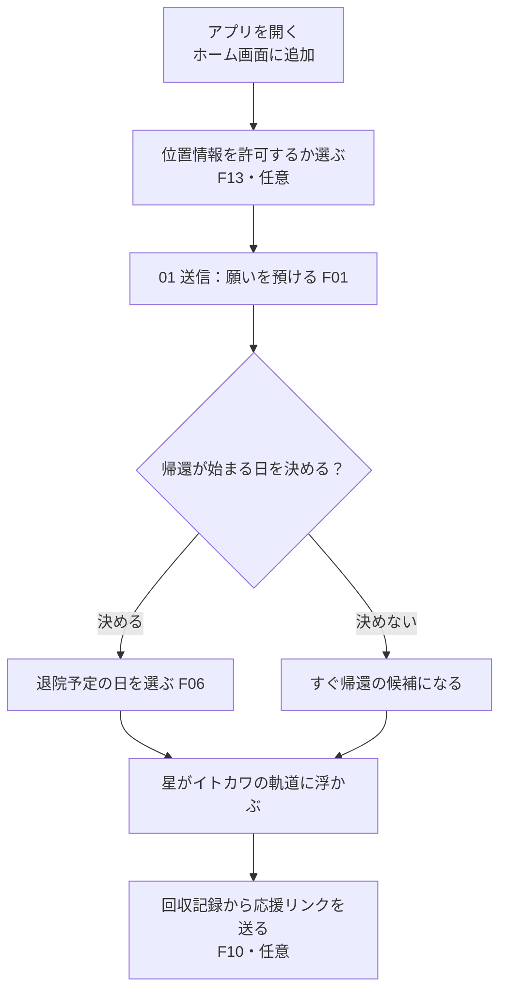
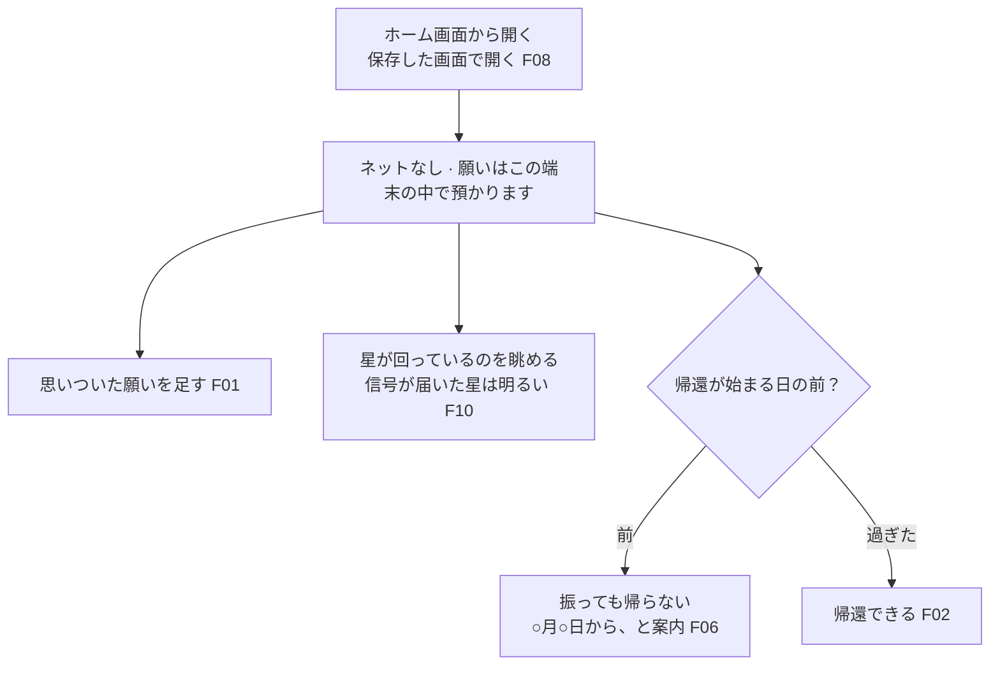
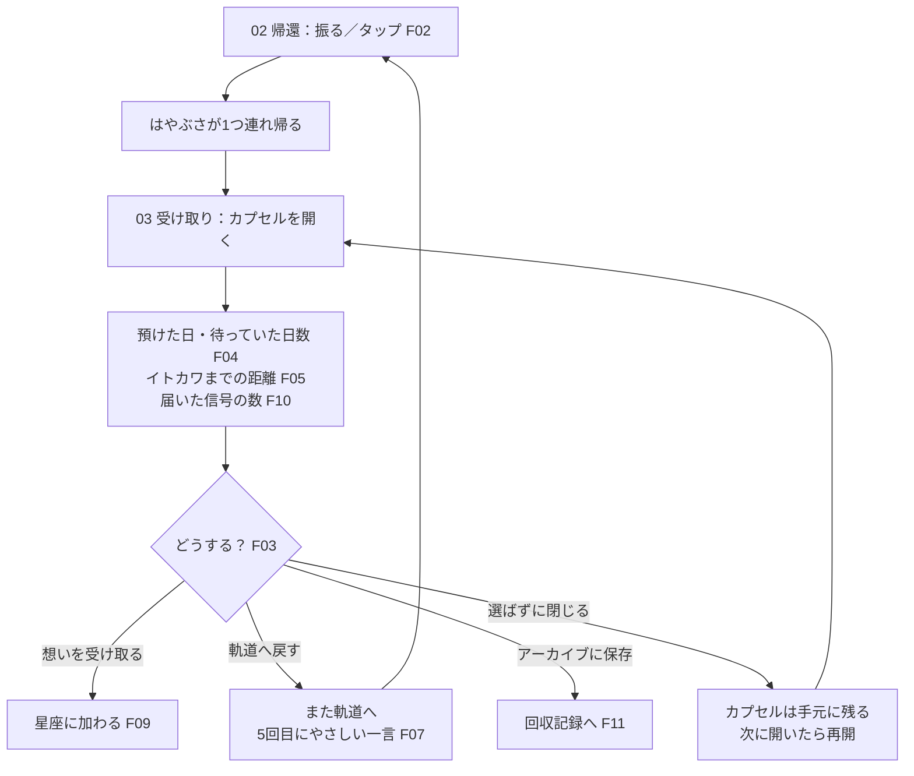
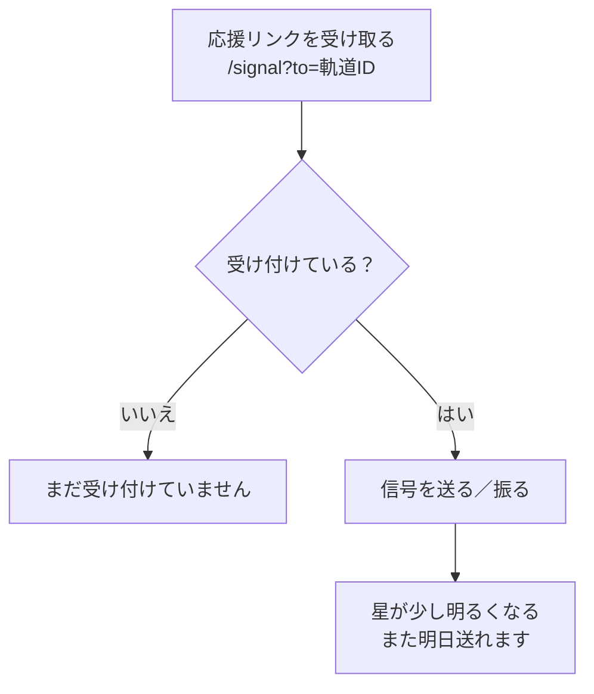

# MORUNE 25143 ユーザーフロー

更新：2026-09-30　機能の ID は `docs/機能要件.md`、状態の動きは `docs/状態設計.md`

## 1. 本人：入院前（家、ネットあり）

## 2. 本人：入院中（病室、ネットなし）

休憩室の Wi-Fi につながったら、届いた応援の信号を取りに行く（F10）。

## 3. 本人：退院後（1つずつ向き合う）

## 4. 応援する人

応援する人には、願いの中身も持ち主の名前も見えない。持ち主は、願いが帰ってきた日に「届いた信号の数」だけを受け取る。
