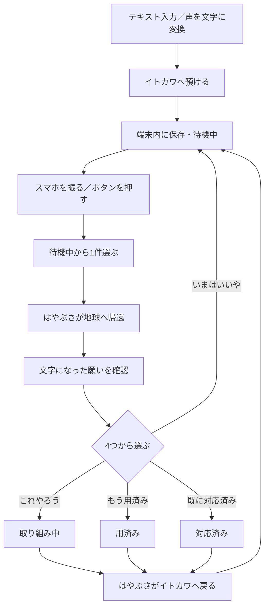

# 25143｜1日版 処理フロー

## 体験の全体像

## 保存するデータと状態

| 項目 | 内容 |
|---|---|
| ID | 1件ごとの識別子 |
| テキスト | 最大180文字。声のみなら空欄可 |
| 状態 | `waiting`、`doing`、`expired`、`done` |
| 日時 | 作成時刻・最後に判断した時刻 |

保存先は同じ端末のブラウザ内のIndexedDB。アプリは願いをサーバーへ送信しない。音声入力にはブラウザの音声認識機能を使うため、その音声処理方法はブラウザに依存する。ブラウザのデータ削除や端末変更では引き継げない。

## 1件を帰還させるルール

1. `waiting` の願いだけを候補にする。
2. 候補からランダムに1件選ぶ。2件以上ある場合、直前に帰還したものは続けて選ばない。
3. 帰還中と判断待ちの間は、次の帰還を受け付けない。
4. 「いまはいいや」は `waiting` に戻す。それ以外は待機候補から外す。
5. 保存に失敗した場合は判断画面を残し、再試行できるようにする。

## 実装に必要なもの

| 役割 | 技術・対応 |
|---|---|
| 画面・アニメーション | HTML、CSS、JavaScript。距離感のある航路をはやぶさが約2.7秒で往復 |
| 音声入力 | SpeechRecognition APIで日本語を文字に変換。非対応ならキーボードの音声入力や手入力を案内 |
| 振る操作 | DeviceMotion API。iPhoneは操作時に動きの許可を要求 |
| 代替操作 | センサー非対応・拒否・PC向けの「振れないときはタップ」 |
| 保存 | IndexedDBにテキスト・状態を保存。旧版の音声Blobは保持 |

## デモ前の確認

- 文字入力と音声入力で1件ずつ保存できる。声の聞き取り結果を保存前に直せる。
- 画面を閉じて再度開いても、件数と文字が残る。
- 振る操作で1件だけ帰還し、振り続けても次の願いは出ない。
- 4つの選択が正しい状態に変わり、はやぶさがイトカワへ戻る。
- マイクや動きの許可を拒否しても、テキストとボタンで体験を完了できる。

> 1日版の範囲：取り組み中の願いを後から編集・完了する機能、端末間同期、ログイン、録音保存は含めない。
