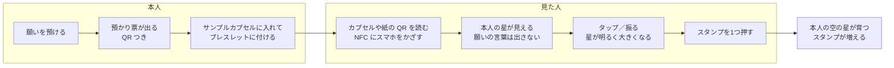

# 見た人が応援する体験と、ウィッシュアクセサリー

作成：2026-10-07　きっかけ：本人の提案（カプセル・ビーズ・ブレスレットのゴムを購入）
関連：`docs/状態設計.md`（応援の信号）、`docs/権利の確認.md`（商品には「25143」・星・MORUNE だけ）

## 変えること：送る応援から、見た人の応援へ

| | 今 | これから |
|---|---|---|
| 入口 | 本人が応援リンクを LINE などで誰かに送る | **見た人が、その場で応援できる**：帰還票・預かり票の QR、シェアした画像、ブレスレットのカプセル（QR／NFC） |
| 応援の手ざわり | 「信号を送る」を押す。結果は本人にしか見えない | **押すと、目の前で星が明るく大きくなる**。スタンプを1つ選んで押せる |
| 本人に届くもの | 帰還の日に「N回の信号」 | 星の明るさ・大きさ＋まわりに押されたスタンプ。発表やイベントでは、**その場で増えていくのが見える** |

## 体験の流れ

## 応援のページ（/signal）でできること

| 操作 | 起きること | 決まり |
|---|---|---|
| ひらく | 本人の星が1つ、夜空に浮かぶ。ほかの人の応援の数だけ明るい | 願いの言葉・名前は出さない（今と同じ） |
| タップ、またはスマホを振る | 星がふくらんで、ひとまわり明るくなる（音と振動つき） | 1台の端末から同じ星へ1日1回（今と同じ上限） |
| スタンプを押す | 星のまわりに小さな印が残る | **言葉は書けない**。選べるのは形だけ（例：✦ 光る、↗ 進め、◎ 見てる）。返信・数のランキングは作らない |

スタンプは「言葉を使わない応援」。荒れやすい自由な書き込みを入れない（類似サービス調査の Yik Yak・Secret、Kind Words・Journey から）。

## ウィッシュアクセサリー：サンプルカプセル

はやぶさが持ち帰った「サンプルカプセル」に見立てる。**25143 SAMPLE RETURN の物語の中の道具**として作り、願掛けやお守りにしない。

| 部品 | 意味 | 作り方 |
|---|---|---|
| カプセル（透明） | 願いを入れる**サンプルカプセル**。預かり票を小さく丸めて入れる | ガチャガチャのカプセル（購入済み） |
| ビーズ | 預けた願いの星。色は**便（フライト）**を表す | UV ビーズ（購入済み） |
| ゴム | ブレスレット | 弾力ゴム紐（購入済み） |
| NFC タグ／QR シール | かざす・読むと、本人の応援ページが開く | 小さな NFC シール（NTAG213 など）をカプセルの内側に。QR シールでも代わりになる |

### 同じブレスレットの人は、同じ便の仲間

- イベントや時期ごとに、ビーズの色を**便**として決める（例：GGA 便、秋の便）
- アプリでは、同じ便の人の星が、夜空の同じあたりに集まって見える（みんなの星を開いたあとに）
- 仲間であることは、**持っているもの**で分かる。名前やフォローではつながらない

### 宗教的・占い的にしないための決まり

| しないこと | かわりに |
|---|---|
| 「願いが叶う」「ご利益」「運気」「パワー」と言う | 「預ける」「持ち歩く」「目に入る場所に置く」「応援が届く」 |
| 数珠に見える形（同じ玉をたくさん、房） | ばらばらの色のビーズ＋透明なカプセル。お祭りのリストバンドのような軽さ |
| 天然石・パワーストーン・誕生石・星占い | UV ビーズ（ただの樹脂）。色は便の名前だけを表す |
| おみくじ・お守り袋の見た目 | 宇宙の**サンプルカプセル**と**観測の記録**の見た目。番号と日付 |
| 祈る・拝むしぐさ | かざす・読む・振る（今のアプリの操作と同じ） |

商品にするときは、「25143」・星・MORUNE だけを入れる（はやぶさの名前や探査機の形は入れない）。

## 振る・QR・NFC のつながり

| 入口 | 誰が | 開くもの |
|---|---|---|
| アプリでスマホを振る | 本人 | 願いが1つ帰ってくる（今と同じ） |
| 帰還票の QR | 本人 | 自分の星（アプリ） |
| 預かり票の応援券・カプセルの QR／NFC | 見た人 | 本人の応援ページ。**振る・タップで星が育つ** |

「振る」は、本人にとっては帰還、見た人にとっては応援。同じしぐさが、立場で意味を変える。

## 発表（GGA）での見せ方の案

1. 舞台で、自分のブレスレットのカプセルを見せる（中に預かり票）
2. スライドに、自分の星の応援ページの QR を出す
3. 会場のみんなが読み取って、タップ／振る
4. **舞台の画面で、自分の星がその場で大きく明るくなっていく**（スタンプが増える）

「ひとりで預けた願いが、見た人に応援されて育つ」を、5分の中で体験として見せられる。

## 作る順番（案）

| いつ | 作るもの | 目安 |
|---|---|---|
| 10/8〜13（セレクション前） | 応援ページ：タップ／振るで星がふくらむ演出、スタンプ（言葉なし3種、端末と サーバーに種類だけ記録）。本人の画面で、応援がその場で増えて見える（数秒ごとに取りに行く） | 1〜1.5日 |
| 10/8〜13 | ブレスレットの試作（カプセル＋ビーズ＋ゴム＋QR シール）。写真をデモ動画とスライドに | 本人 |
| GGA まで | NFC シール対応（中身は応援ページの URL だけ）、預かり票の応援券に本物の QR | 0.5日 |
| GGA のあと | 便（ビーズの色）と、同じ便の星が集まる表示（みんなの星を開いてから） | 未定 |

## 決めること

- スタンプの種類と形（3種でよいか）
- サーバーに記録するのは「軌道ID・時刻・スタンプの種類」だけでよいか（AGENTS.md と利用規約の「送ってよいもの」に足す）
- NFC シールを買うか（QR シールだけで始めるか）
- 便の色の決め方
