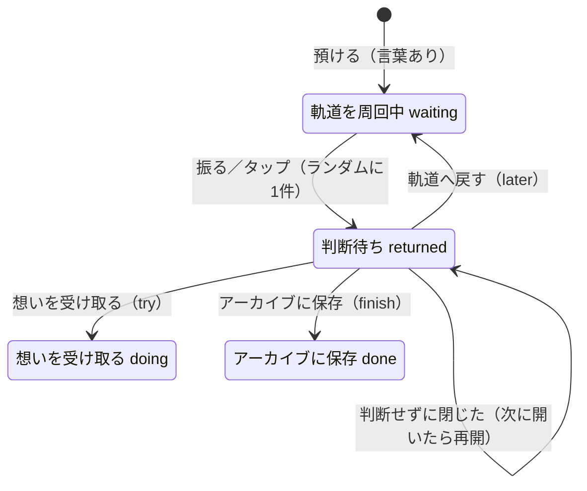
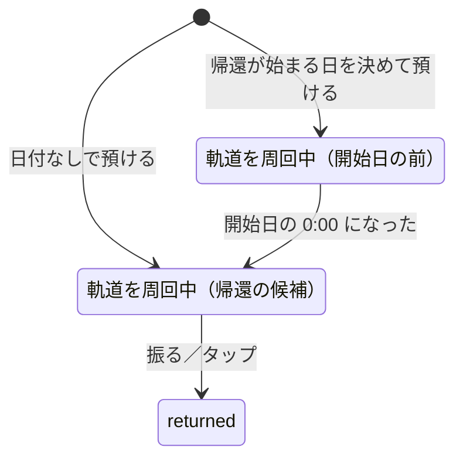
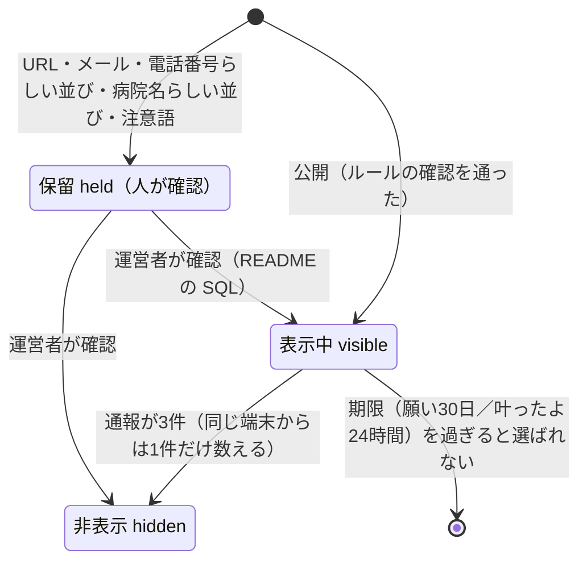
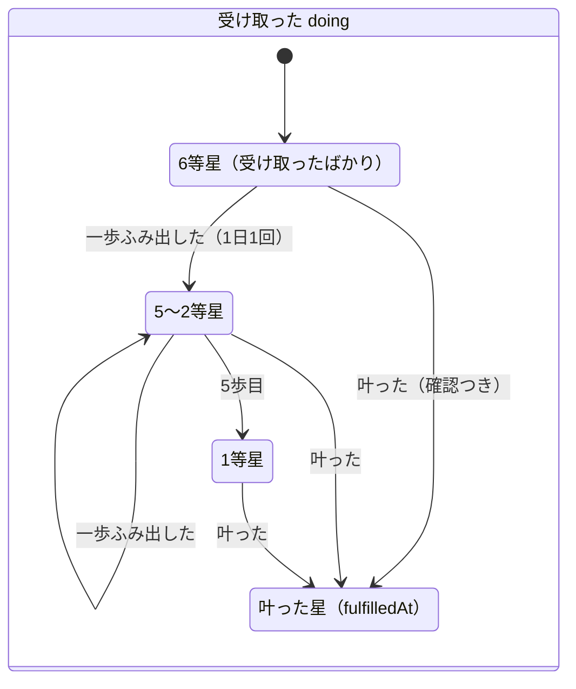

# MORUNE 25143 状態設計

作成：2026-09-29　対象ブランチ：`feat/graduation-wish-states`（`infra/cloudflare-workers-migration` から分岐）

GSの増渕メンターが示した対話設計の型で、願い1件の状態を定義し直した。
状態遷移は `public/wish-state.js` に集め、`npm test` で確かめる。画面・保存・演出は `public/mission.js` が担当する。

## 型の対応

| 型の用語 | 25143 での意味 |
| --- | --- |
| Utterance（発話） | 使う人の操作。願いを打つ、振る、タップ、キーホルダーをかざす、カードの3つのボタン |
| Intent（意図） | 預けたい／呼び戻したい／中身を見たい／決めたい／記録を見たい |
| Entity（中身） | 願いの言葉、預けた日（`createdAt`）、決めた日（`updatedAt`） |
| State（状態） | 願い1件ごとの状態（下図）と、画面の状態（観測中・帰還飛行・着地・カプセル） |
| Slot Filling | 預けるのに必要なのは「言葉」1つだけ。空なら聞き返す |
| Clarification（聞き返し） | 帰ってきた願いに3つの選択肢を出す |
| Context Switch | どの画面からでも回収記録を開ける。Esc でどこからでも閉じる |
| Fallback（退避） | 振れない端末はタップ。3D星空が読めなければ簡易表示。軌道が空なら「すべての願いは地球にあります」 |

## 願い1件の状態



- 帰還の候補は `waiting` だけ（`returnCandidates`）
- 判断待ちの願いがあるあいだは、次の帰還を始めない。先にカプセルを開くよう案内する
- 保存先が受け付ける `later`（保留）・`expired`（手放した）は、ハッカソン初期の4択の名残。画面からは入れない。既存データの表示のためにラベルだけ残す

## 2026-09-29 に直したこと

**行き止まり**：以前は、帰ってきた願いを判断せずに閉じると `returned` のまま残り、振っても帰ってこず、回収記録から判断し直すこともできなかった。
「今でなくてもいい。まだ無理なら、また預けていい」という作品の考え方が、ここで守られていなかった。

- 判断せずに閉じても、カプセルは手元に残る（`closeCard` の `decided` が false のとき）
- アプリを開き直したときは、判断待ちの願いを最初に差し出す（`pendingReturn`）

**待っていた日数**：帰還カードに「○日間、イトカワの軌道であなたを待っていました。」を出す。時刻ではなく暦の日付で数える（`daysWaited`）。

## 2026-09-29〜30 に足したこと

### 帰還が始まる日（#7）



- 状態（`status`）は増やさず、`waiting` の中を `returnFrom` で分ける。星としては描くが、帰還の候補にしない（`orbitingWishes` と `returnCandidates` を分けた）
- 候補がないときは「○月○日から、帰還が始まります」と案内し、振る・タップを止める（Fallback）
- ログインして同期する場合、`returnFrom` はサーバーに保存されない（本番は同期なし）

### はじめての1回（#27）

- 一度も帰ってきた願いがない人（すべての願いが waiting）は、帰還が始まる日の前でも1回だけ帰せる（`trialAvailable`・`candidatesWithTrial`）
- 使ったかどうかは端末の localStorage に残す。ふつうの候補があれば、そちらを優先する
- 理由：やりたいことのアプリは最初の1週間で価値が見えないと離れる（`docs/類似サービス調査.md`）

### ネットなしで使えるようにする（#5）

`public/sw.js` と `public/offline-routes.js`。願いのデータは IndexedDB にあるので、Service Worker は画面と部品だけを扱う。

| 振り分け | 対象 | 扱い |
| --- | --- | --- |
| page | ページ本体 | ネット優先。4秒でつながらなければ保存した版 |
| fresh | `/mission.js` など名前が変わらない自前の部品 | ネット優先（公開直後に古い版が混ざらないため） |
| asset | `/_next/static/`・アイコン・Three.js・Google Fonts | 保存した版を先に出し、裏で更新 |
| bypass | `/api/`・ログイン・`sw.js` | 触らない |

### イトカワまでの実際の距離（#6）

NASA/JPL Horizons の暦（2026-01-01〜2030-12-31、1日ごと）を `public/itokawa-distance.json` に同梱。状態には影響しない。

### 受け取った願いの星座

**2026-10-07 にやめた**（本人の判断：見栄えがよくなく、星だけでは意味が伝わらない）。以前は `doing`・`done` の願いを、言葉の近さ（2文字ずつの重なり）で最小全域木（Prim 法）につないでいた。育つ（等級）は回収記録の一覧の「○等星」で見せる。

### 応援の信号

願いの状態とは独立した、軌道（端末）ごとの記録。

- 持ち主の端末が軌道ID（UUID）を1度だけ作り、応援リンク `/signal?to=軌道ID` を送る
- 応援する人が押す／振ると、サーバーの D1 `signals` 表に「軌道ID・時刻」だけが残る
- 持ち主の端末は届いた時刻を取りに行き、端末にも控える。星の明るさと帰還カードの数は、願いが `waiting` だった期間に届いた分で数える（`signalsWhileWaiting`）
- D1 の `DB` がない環境では、API が `{enabled:false}` を返し、機能ごと隠れる

#### 本番で有効にする手順（2026-09-30 に 1〜3 を実施、4 は公開の了承待ち）

1. `npx wrangler d1 create morune-25143`（APAC。応援の信号と、みんなの星で同じ D1 を使う）
2. 出てきた `database_id` を `wrangler.jsonc` の `d1_databases`（`binding: "DB"`、`migrations_dir: "drizzle"`）に書く
3. `npx wrangler d1 execute morune-25143 --remote --file drizzle/0001_signals.sql`
4. `npm run build` → `npx wrangler deploy --config wrangler.jsonc`

手元の開発サーバーでは、`--local` で同じ SQL を流すと使える。

### みんなの星（#22・#23）

願い1件の状態とは独立した、サーバー側の「公開された言葉」の状態。設計は `docs/みんなの星_設計.md`、数とルールは `app/api/stars/rules.mjs`、画面側の決まりは `public/public-stars.js`。



- 公開は願いごとに選ぶ（初期値は流さない）。はじめてだけ、画面の中の約束に同意する（Clarification）
- ネットがないとき：公開は端末に控え、Wi-Fi につながったら流す。通報と信号は「Wi-Fi につながったら」と案内する（Fallback）。自分の願いを預けることは止めない
- サーバーに `DB` がない環境では `{enabled:false}` を返し、画面から機能ごと隠れる
- 他の人の星への応援の信号は、星から持ち主の軌道をサーバーで引いて送る（軌道ID を画面に渡さない）。上限は応援リンクと共通（`app/api/signals/record.ts`）

#### 本番で有効にする手順（公開の了承待ち）

みんなの星は、D1 があるだけでは開かない。`wrangler.jsonc` の `PUBLIC_STARS_ENABLED` が `"true"` のときだけ開く（`app/api/stars/rules.mjs` の `publicStarsEnabled`）。応援の信号と同じ D1 を使うため、「表がなくて止まっている」のか「本当の障害」なのかを分けるためのスイッチ。2026-10-05 時点は `"false"`（投稿を見守る人がいない期間は開かない、2026-10-04 Claude×Codex 協議）。

1. `npx wrangler d1 execute morune-25143 --remote --file drizzle/0002_public_stars.sql`（本人の了承のあとで）
2. `wrangler.jsonc` の `PUBLIC_STARS_ENABLED` を `"true"` にする（本人の了承のあとで）
3. `npm run build` → `npx wrangler deploy --config wrangler.jsonc`

手元で試すときは、`.dev.vars` に `PUBLIC_STARS_ENABLED=true` を書く（コミットしない）。

手元では、開発サーバーが使う D1 に `drizzle/0001_signals.sql` と `drizzle/0002_public_stars.sql` を流すと試せる。

### 育つ願い（2026-10-05、ブランチ feat/wish-grows）

願うだけで終わらせないため、受け取った（`doing`）願いは小さな一歩ごとに明るくなる。状態（`status`）は増やさず、`doing` の中に「一歩の記録」と「叶った日」を持たせる。ルールは `public/wish-state.js` の `GROWTH`・`canStep`・`recordStep`・`setFirstStep`・`markFulfilled`・`magnitude`、テストは `tests/wish-growth.test.mjs`。



| 決めたこと | 理由 |
| --- | --- |
| 明るさは本物の星の等級（6等星→1等星）で表す | 宇宙の物語のまま「育つ」を見せる。数字の大小が直感と逆なので、画面では「○等星」と言葉で出す |
| 一歩は1日1回まで | 続けて押して一気に明るくすると、育つ意味がなくなる |
| 暗くならない。期限・連続日数・他の人との比較を持たない | ToDo にしない。「今でなくてもいい」 |
| 「最初の小さな一歩」は60字まで、書かなくてもいい | 書くことを重荷にしない |
| `updatedAt` は変えない（`steps`・`fulfilledAt` を別に持つ） | 応援の信号を「判断した時点まで」で数えるのに `updatedAt` を使っているため |
| 星座の星の大きさ＝応援（信号）×自分の一歩（等級）。叶った星には光の輪 | 明るさが「自分の一歩」と「誰かの応援」の両方で育つ |
| 「叶った」は確認してから記録し、取り消しは作らない | 誤タップを防ぐ。叶ったあとに一歩は数えない |

- 保存は願いごとに押した順で1つずつ行う（`public/keyed-queue.js`）。書きかけ・保存できなかった「最初の一歩」は下書きとして持ち、描き直しで捨てない。入力欄から出るだけで保存し直す。一覧の中を押している最中は描き直さない（iPhone の Safari はボタンへフォーカスを移さず、描き直すと click が届かないため）。確かめ方：Playwright で、書いてすぐ押す・Safari のまね・保存の失敗2回を通した（2026-10-05）
- ログインして同期する場合、`steps`・`firstStep`・`fulfilledAt` はサーバーに保存されない（`returnFrom` と同じ。本番は同期なし）
- 「叶った」は自分だけの記録。みんなの星の「叶ったよ」（公開・24時間の流れ星）とは別で、つなぐかどうかは本人の判断待ち

### 番号：25143-人-願い（2026-10-06）

```
25143 - 0007 - 03
  │      │      └ 願いの番号：その人が預けた何個目の願いか（端末で数える。サーバーに送らない）
  │      └ 人の番号：参加した何人目か（最初に願いを預けたとき、サーバーで1回だけ発行）
  └ シリーズ：この作品（小惑星イトカワの番号から）
```

- 人の番号：`POST /api/orbits`（軌道ID だけを受け取る）。`orbits` 表に 1 から順に入れる。何度呼んでも同じ番号を返す。ネットがないときは預けることを止めず、つながったとき・次に開いたときに受け取る。表は `drizzle/0003_orbits.sql`
- 作者は **25143-0000**（番号 0）。本人の端末の軌道ID を、運営者が SQL で 0 に登録する（README「作者の番号」）
- 願いの番号：`nextWishSeq`（消した番号は使い回さない。端末の localStorage に、これまでの最大を覚える）。番号を持たない前からの願いは、預けた順に数えて表示する（`wishSeqOf`）
- 出す場所：回収記録の「あなたの番号」（人）、カプセル・帰還票（願い）、受取票（願い／応援券は人）
- テスト：`tests/wish-number.test.mjs`、`tests/star-rules.test.mjs`（`formatNumber`）

## 登録できる数とルール（#17）

講師の質問を受け、使う人（しばらく離れる本人＝当初は入院・治療中を想定、応援する家族・友人）と場面を想定して決めた。数字は `public/wish-state.js` の `LIMITS`、`public/constellation.js` の `CONSTELLATION_LIMIT`、`app/api/signals/rules.mjs` にまとめてある。

| ルール | 決めたこと | 理由 |
| --- | --- | --- |
| 軌道に置ける願い | 30個まで。いっぱいなら預けず、入力は残す | 1日1つ帰すと約1か月分（一般病床の平均在院日数は約16日＋回復期）。多すぎるとリストが重荷に戻る |
| 1回に帰る数 | 1つ。判断するまで次は帰らない | 1つずつ向き合う |
| 文字数 | 60字 | 1行で読める |
| 帰還が始まる日 | 翌日〜1年後 | 打ち間違いを防ぐ。長い保存は端末から消えるリスクがある |
| 軌道へ戻す回数 | 決めない。5回目に一度だけ「手放しても大丈夫」と伝える（`laterCount`） | 今でなくてもいい。責めない |
| 星座の表示 | 新しく受け取った100件まで。記録は消さない | 表示が混み合わない |
| 応援の信号 | 同じ星へ1台の端末から1日1回（端末側）、1つの星へ24時間で100回・1分30回（サーバー側）、1年で削除 | 「○回」が応援の人数と日数の目安になる。いたずら対策 |
| 星空に流す願い | 60字、1つの軌道から24時間で3つまで、30日で空から消える | 連投で星空が1人の言葉で埋まらないように |
| 叶ったよ | 40字、24時間で3つまで、24時間で消える | 1日だけの流れ星 |
| 1回に見える他の人の星 | 12個（ランダム、自分の星は除く） | 自分の星が埋もれない |
| 通報 | 1台の端末から同じ星へ1回。3件で非表示 | 1人のいたずらで消えないように。消す判断は人が持つ |


## 本物の星空（2026-10-07）

`public/sky.js` が端末時刻と位置から恒星時・高度・方位を計算する。位置は送信・永続保存しない。拒否・未対応時は東京（35.68, 139.76）。同梱データを使い1分ごとと画面復帰時に更新し、願いの状態遷移には影響しない。真北・高度45度の固定視線で、端末の向きとは連動しない。3Dが使えない場合は天頂を中心にした2D星図。昼間も星を表示し、大気差・歳差・地形は含めない。大きなイトカワと軌道は演出、小さな水色の印と方位・高度が実際の方向。地平線下・暦の期間外・データ未取得は明示する。データ未取得でも願いを使え、再接続後に再読み込みできる。

恒星：Yale Bright Star Catalogue（Hoffleit & Warren 1991）、[VizieR V/50](https://cdsarc.cds.unistra.fr/viz-bin/cat/V/50)、6等級まで5080個（肉眼で見える星ほぼすべて）。VizieR catalogue access tool, CDS, Strasbourg, France（DOI: 10.26093/cds/vizier）に謝意を表します。イトカワ：[NASA/JPL Horizons](https://ssd.jpl.nasa.gov/horizons/)、地心ICRF赤経・赤緯、2026-10-01〜2027-12-31の毎日00:00 UT、線形補間（赤経の0度折り返しを考慮）。期間外は外挿しない。JSとJSONをService Workerで保存し、実行時に外部の天文APIへ問い合わせない。
