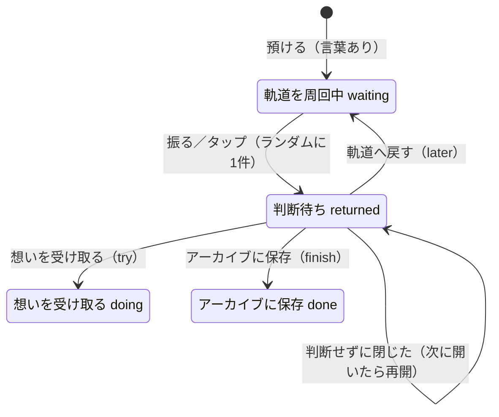

# MORUNE 25143 状態設計

作成：2026-09-29　対象ブランチ：`feat/graduation-wish-states`（`infra/cloudflare-workers-migration` から分岐）

GSの増渕メンターが示した対話設計の型で、願い1件の状態を定義し直した。
状態遷移は `public/wish-state.js` に集め、`npm test` で確かめる。画面・保存・演出は `public/mission.js` が担当する。

## 型の対応

| 型の用語 | 25143 での意味 |
| --- | --- |
| Utterance（発話） | 使う人の操作。願いを打つ、振る、タップ、キーホルダーをかざす、カードの3つのボタン |
| Intent（意図） | 預けたい／呼び戻したい／中身を見たい／決めたい／記録を見たい |
| Entity（中身） | 願いの言葉、預けた日（`createdAt`）、決めた日（`updatedAt`） |
| State（状態） | 願い1件ごとの状態（下図）と、画面の状態（観測中・帰還飛行・着地・カプセル） |
| Slot Filling | 預けるのに必要なのは「言葉」1つだけ。空なら聞き返す |
| Clarification（聞き返し） | 帰ってきた願いに3つの選択肢を出す |
| Context Switch | どの画面からでも回収記録を開ける。Esc でどこからでも閉じる |
| Fallback（退避） | 振れない端末はタップ。3D星空が読めなければ簡易表示。軌道が空なら「すべての願いは地球にあります」 |

## 願い1件の状態

- 帰還の候補は `waiting` だけ（`returnCandidates`）
- 判断待ちの願いがあるあいだは、次の帰還を始めない。先にカプセルを開くよう案内する
- 保存先が受け付ける `later`（保留）・`expired`（手放した）は、ハッカソン初期の4択の名残。画面からは入れない。既存データの表示のためにラベルだけ残す

## 2026-09-29 に直したこと

**行き止まり**：以前は、帰ってきた願いを判断せずに閉じると `returned` のまま残り、振っても帰ってこず、回収記録から判断し直すこともできなかった。
「今でなくてもいい。まだ無理なら、また預けていい」という作品の考え方が、ここで守られていなかった。

- 判断せずに閉じても、カプセルは手元に残る（`closeCard` の `decided` が false のとき）
- アプリを開き直したときは、判断待ちの願いを最初に差し出す（`pendingReturn`）

**待っていた日数**：帰還カードに「○日間、イトカワの軌道であなたを待っていました。」を出す。時刻ではなく暦の日付で数える（`daysWaited`）。

## これからの拡張（卒業制作 2026-10-07 まで）

| 優先 | 内容 | 状態の設計への影響 |
| --- | --- | --- |
| 1 | 病室で使えるようにする（画面を端末に保存・PWA） | なし。3D星空は CDN から読むので、端末への保存対象に含めるか、簡易表示に退避する |
| 2 | 端末に先に保存し、Wi-Fi で送る | 願いの状態とは別に「未送信 → 送信中 → 送信済み」の層を持つ。今はログイン中にネットがないと起動できない |
| 3 | イトカワまでの実際の距離 | なし（表示のみ）。公開データを日ごとの表にして同梱し、ネットなしでも出す |
| 4 | 帰還が始まる日 | `waiting` の候補に「開始日以降」という条件を足す |
