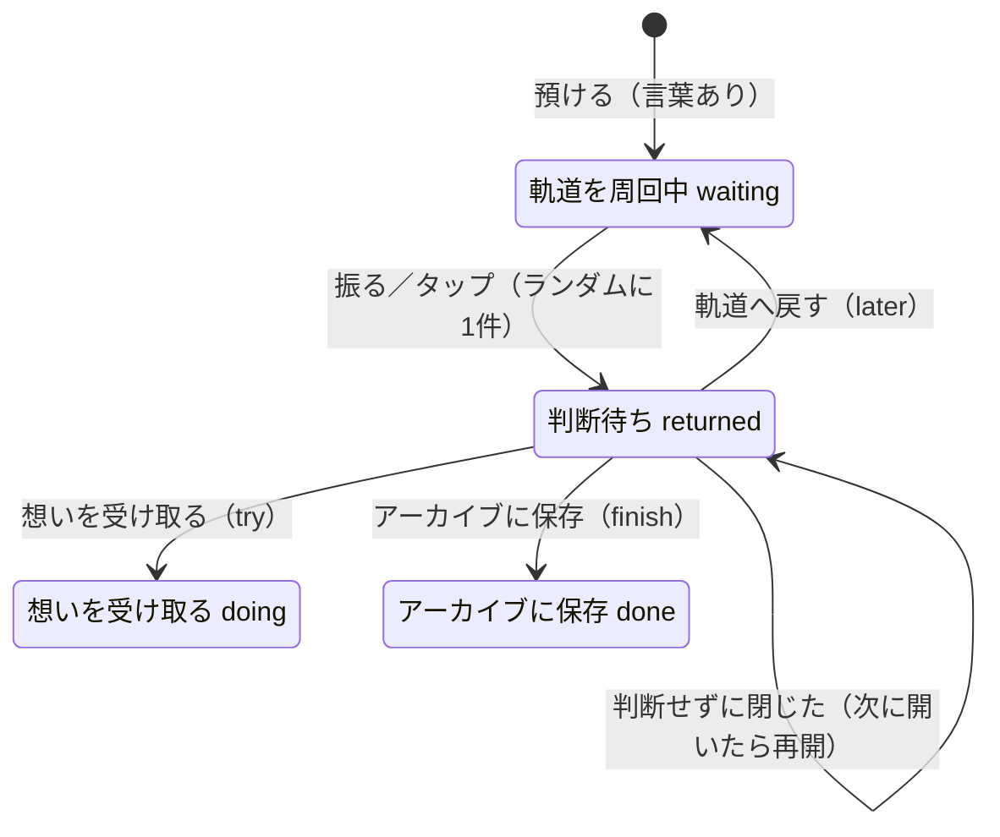
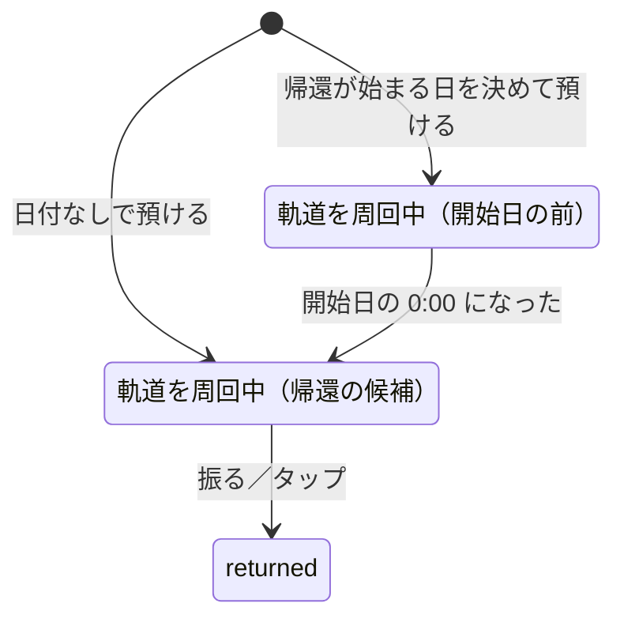

# MORUNE 25143 状態設計

作成：2026-09-29　対象ブランチ：`feat/graduation-wish-states`（`infra/cloudflare-workers-migration` から分岐）

GSの増渕メンターが示した対話設計の型で、願い1件の状態を定義し直した。
状態遷移は `public/wish-state.js` に集め、`npm test` で確かめる。画面・保存・演出は `public/mission.js` が担当する。

## 型の対応

| 型の用語 | 25143 での意味 |
| --- | --- |
| Utterance（発話） | 使う人の操作。願いを打つ、振る、タップ、キーホルダーをかざす、カードの3つのボタン |
| Intent（意図） | 預けたい／呼び戻したい／中身を見たい／決めたい／記録を見たい |
| Entity（中身） | 願いの言葉、預けた日（`createdAt`）、決めた日（`updatedAt`） |
| State（状態） | 願い1件ごとの状態（下図）と、画面の状態（観測中・帰還飛行・着地・カプセル） |
| Slot Filling | 預けるのに必要なのは「言葉」1つだけ。空なら聞き返す |
| Clarification（聞き返し） | 帰ってきた願いに3つの選択肢を出す |
| Context Switch | どの画面からでも回収記録を開ける。Esc でどこからでも閉じる |
| Fallback（退避） | 振れない端末はタップ。3D星空が読めなければ簡易表示。軌道が空なら「すべての願いは地球にあります」 |

## 願い1件の状態

- 帰還の候補は `waiting` だけ（`returnCandidates`）
- 判断待ちの願いがあるあいだは、次の帰還を始めない。先にカプセルを開くよう案内する
- 保存先が受け付ける `later`（保留）・`expired`（手放した）は、ハッカソン初期の4択の名残。画面からは入れない。既存データの表示のためにラベルだけ残す

## 2026-09-29 に直したこと

**行き止まり**：以前は、帰ってきた願いを判断せずに閉じると `returned` のまま残り、振っても帰ってこず、回収記録から判断し直すこともできなかった。
「今でなくてもいい。まだ無理なら、また預けていい」という作品の考え方が、ここで守られていなかった。

- 判断せずに閉じても、カプセルは手元に残る（`closeCard` の `decided` が false のとき）
- アプリを開き直したときは、判断待ちの願いを最初に差し出す（`pendingReturn`）

**待っていた日数**：帰還カードに「○日間、イトカワの軌道であなたを待っていました。」を出す。時刻ではなく暦の日付で数える（`daysWaited`）。

## 2026-09-29〜30 に足したこと

### 帰還が始まる日（#7）

- 状態（`status`）は増やさず、`waiting` の中を `returnFrom` で分ける。星としては描くが、帰還の候補にしない（`orbitingWishes` と `returnCandidates` を分けた）
- 候補がないときは「○月○日から、帰還が始まります」と案内し、振る・タップを止める（Fallback）
- ログインして同期する場合、`returnFrom` はサーバーに保存されない（本番は同期なし）

### はじめての1回（#27）

- 一度も帰ってきた願いがない人（すべての願いが waiting）は、帰還が始まる日の前でも1回だけ帰せる（`trialAvailable`・`candidatesWithTrial`）
- 使ったかどうかは端末の localStorage に残す。ふつうの候補があれば、そちらを優先する
- 理由：やりたいことのアプリは最初の1週間で価値が見えないと離れる（`docs/類似サービス調査.md`）

### 病室で使えるようにする（#5）

`public/sw.js` と `public/offline-routes.js`。願いのデータは IndexedDB にあるので、Service Worker は画面と部品だけを扱う。

| 振り分け | 対象 | 扱い |
| --- | --- | --- |
| page | ページ本体 | ネット優先。4秒でつながらなければ保存した版 |
| fresh | `/mission.js` など名前が変わらない自前の部品 | ネット優先（公開直後に古い版が混ざらないため） |
| asset | `/_next/static/`・アイコン・Three.js・Google Fonts | 保存した版を先に出し、裏で更新 |
| bypass | `/api/`・ログイン・`sw.js` | 触らない |

### イトカワまでの実際の距離（#6）

NASA/JPL Horizons の暦（2026-01-01〜2030-12-31、1日ごと）を `public/itokawa-distance.json` に同梱。状態には影響しない。

### 受け取った願いの星座

`doing`・`done` の願いを、言葉の近さ（2文字ずつの重なり）で最小全域木（Prim 法）につなぐ。状態には影響しない（表示のみ）。

### 応援の信号

願いの状態とは独立した、軌道（端末）ごとの記録。

- 持ち主の端末が軌道ID（UUID）を1度だけ作り、応援リンク `/signal?to=軌道ID` を送る
- 応援する人が押す／振ると、サーバーの D1 `signals` 表に「軌道ID・時刻」だけが残る
- 持ち主の端末は届いた時刻を取りに行き、端末にも控える。星の明るさと帰還カードの数は、願いが `waiting` だった期間に届いた分で数える（`signalsWhileWaiting`）
- D1 の `DB` がない環境では、API が `{enabled:false}` を返し、機能ごと隠れる

#### 本番で有効にする手順（未実施）

1. `npx wrangler d1 create morune-25143-signals`
2. 出てきた `database_id` を `wrangler.jsonc` の `d1_databases`（`binding: "DB"`、`migrations_dir: "drizzle"`）に書く
3. `npx wrangler d1 execute morune-25143-signals --remote --file drizzle/0001_signals.sql`
4. `npm run build` → `npx wrangler deploy --config wrangler.jsonc`

手元の開発サーバーでは、`--local` で同じ SQL を流すと使える。

## 登録できる数とルール（#17）

講師の質問を受け、使う人（入院・治療中の本人、応援する家族・友人）と場面を想定して決めた。数字は `public/wish-state.js` の `LIMITS`、`public/constellation.js` の `CONSTELLATION_LIMIT`、`app/api/signals/rules.mjs` にまとめてある。

| ルール | 決めたこと | 理由 |
| --- | --- | --- |
| 軌道に置ける願い | 30個まで。いっぱいなら預けず、入力は残す | 1日1つ帰すと約1か月分（一般病床の平均在院日数は約16日＋回復期）。多すぎるとリストが重荷に戻る |
| 1回に帰る数 | 1つ。判断するまで次は帰らない | 1つずつ向き合う |
| 文字数 | 60字 | 1行で読める |
| 帰還が始まる日 | 翌日〜1年後 | 打ち間違いを防ぐ。長い保存は端末から消えるリスクがある |
| 軌道へ戻す回数 | 決めない。5回目に一度だけ「手放しても大丈夫」と伝える（`laterCount`） | 今でなくてもいい。責めない |
| 星座の表示 | 新しく受け取った100件まで。記録は消さない | 表示が混み合わない |
| 応援の信号 | 同じ星へ1台の端末から1日1回（端末側）、1つの星へ24時間で100回・1分30回（サーバー側）、1年で削除 | 「○回」が応援の人数と日数の目安になる。いたずら対策 |
